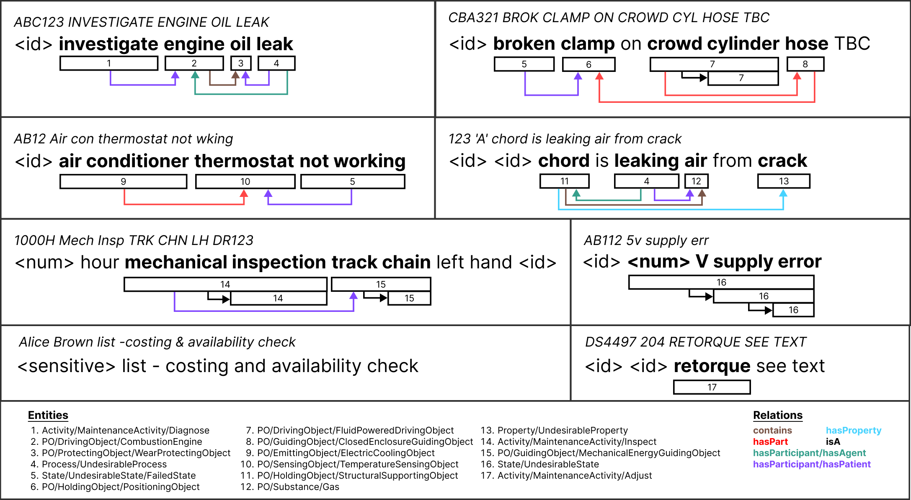

# MaintIE: A Fine-Grained Annotation Schema and Benchmark for Information Extraction from Low-Quality Maintenance Short Texts

This repository contains the data, models, and code accompanying the paper titled "MaintIE: A Fine-Grained Annotation Schema and Benchmark for Information Extraction from Low-Quality Maintenance Short Texts", submitted to [LREC-Coling 2024](https://lrec-coling-2024.org/).

## Table of Contents

1. [Overview](#1-overview)
2. [Scheme](#2-scheme)
3. [Corpora](#3-corpora)
   1. [Overview](#31-overview)
   2. [Format](#32-format)
   3. [Normalisation and Sanitisation](#33-normalisation-and-sanitisation)
   4. [Statistics](#34-statistics)
      1. [Overview](#341-overview)
      2. [Fine-Grained Expert-Annotated Corpus](#342-fine-grained-expert-annotated-corpus)
      3. [Coarse-Grained Large-Scale Corpus](#343-coarse-grained-large-scale-corpus)
4. [Models](#4-models)
5. [Results](#5-results)
6. [License](#6-license)
7. [Contributing](#7-contributing)
8. [Contact](#8-contact)

## 1. Overview

Maintenance work orders (MWO) are concise and information-rich, user-generated technical texts capturing data on the state of, and work on, machines, infrastructure and other engineered assets. These assets are the foundation of our modern economy. Information captured in MWO is vital for asset management decision-making but is challenging to extract and use at scale.

This repository contains MaintIE, [a multi-level fine-grained annotation scheme for entity recognition and relation extraction](SCHEME.md), consisting of 5 top-level classes: PhysicalObject, State, Process, Activity and Property and 224 leaf entities, along with 6 relations tailored to MWOs. Using MaintIE, we have curated a multi-annotator, high-quality, [fine-grained corpus of 1,076 annotated texts ](./data/gold_release.json). Additionally, we present a [coarse-grained corpus of 7,000 texts](./data/silver_release.json) and consider its performance for bootstrapping and enhancing fine-grained information extraction. Using these corpora, we provide model [performance measures for benchmarking automated entity recognition and relation extraction](RESULTS.md). This repository contains the MaintIE scheme, corpus, and models, which are available under the [MIT license](LICENSE.md), encouraging further community exploration and innovation in extracting valuable insights from MWOs.



## 2. Scheme

The MaintIE annotation scheme is described in the [Scheme](./SCHEME.md) section of the repository.

## 3. Corpora

### 3.1. Overview

The annotated MaintIE corpora is composed of two sub-corpora - 1) the Fine-Grained Expert-Annotated corpus (`./data/gold_release.json`), and 2) the Coarse-Grained Large-Scale corpus (`./data/silver_release.json`). Statistics of the MaintIE corpora, including the top-level entities and relations in these two sub-corpora, are outlined [below](#statistics).

### 3.2. Format

Both corpora comprise a set of items pertaining to texts annotated with entities and relations. An example item is shown below.

```json
[
  {
    "text": "change out engine",
    "tokens": ["change", "out", "engine"],
    "entities": [
      {
        "start": 0,
        "end": 2,
        "type": "Activity/MaintenanceActivity/Replace"
      },
      {
        "start": 3,
        "end": 4,
        "type": "PhysicalObject/DrivingObject/CombustionEngine"
      }
    ],
    "relations": [
      {
        "head": 0,
        "tail": 1,
        "type": "hasParticipant/hasPatient"
      }
    ]
  }
]
```

Where the fields correspond to:

- `text`: Lexically normalised and sanitised MWO short text (string)
- `tokens`: Tokenized text (Array[string])
- `entities`: Entities corresponding to tokens in `tokens` (Array[Object])
  - `start`: Start token index of entity span (integer)
  - `end`: End token index of entity span (integer)
  - `type`: Entity type corresponding to the entity span (string)
- `relations`: Relations between entities in `entities` (Array[Object])
  - `head`: Index of head entity (integer)
  - `tail`: Index of tail entity (integer)
  - `type`: Relation type corresponding to the relation (string)

### 3.3. Normalisation and Sanitisation

Before undergoing semantic annotation, the MaintIE corpus underwent two primary preprocessing steps: **normalisation** and **sanitisation**.

**Normalisation** involved:

- Converting non-canonical words to their canonical forms.
- Expanding abbreviations.
- Correcting character casing.

**Sanitisation** ensured the privacy and relevance of the data by:

- Masking sensitive information with the token `<sensitive>`.
- Representing non-semantic data, such as IDs, numbers, and dates, with the respective tokens: `<id>`, `<num>`, and `<date>`.

For examples illustrating this transformation process, refer to the [overview section](#1-overview).

### 3.4. Statistics

#### 3.4.1. Overview

| Measure                    | Value                 |
| -------------------------- | --------------------- |
| Total Texts                | 8,076 (1,076 + 7,000) |
| Total Tokens               | 43,674                |
| Unique Tokens (Vocabulary) | 2,409                 |
| Minimum Tokens / Text      | 1                     |
| Maximum Tokens / Text      | 13                    |
| Average Tokens / Text      | 5.4                   |

#### 3.4.2. Fine-Grained Expert-Annotated Corpus

The Fine-Grained Expert-Annotated corpus (gold standard) comprises 1,067 texts double annotated by two domain experts. The table below contains the distribution of top-level entities and relations in this corpus.

|     |                           | Total     |      | Unique    |      |
| --- | ------------------------- | --------- | ---- | --------- | ---- |
| #   | **Entity Type**           | **Count** | %    | **Count** | %    |
| 1   | Activity                  | 278       | 9.0  | 27        | 9.0  |
| 2   | PhysicalObject            | 1,994     | 58.7 | 222       | 73.8 |
| 3   | Process                   | 146       | 4.0  | 9         | 3.0  |
| 4   | Property                  | 35        | 1.0  | 1         | 0.3  |
| 5   | State                     | 438       | 12.9 | 42        | 14.0 |
|     |                           | 3,397     | 100  | 301       | 100  |
| #   | **Relation Type**         | **Count** | %    | **Count** | %    |
| 1   | contains                  | 38        | 1.6  | 15        | 0.9  |
| 2   | hasPart                   | 533       | 22.8 | 417       | 23.7 |
| 3   | hasParticipant/hasAgent   | 166       | 7.1  | 127       | 7.2  |
| 4   | hasParticipant/hasPatient | 1,206     | 51.5 | 936       | 53.3 |
| 5   | hasProperty               | 34        | 1.5  | 28        | 1.6  |
| 6   | isA                       | 364       | 15.5 | 234       | 13.3 |
|     | **Total**                 | 2,341     | 100  | 1,757     | 100  |

#### 3.4.3. Coarse-Grained Large-Scale Corpus

The Coarse-Grained Large-Scale corpus (silver standard) comprises 7,000 texts annotated by a deep learning model trained on the fine-grained corpus and subsequently reviewed and validated by a single domain expert. The table below contains the distribution of top-level entities and relations in this corpus.

|     |                           | Total     |      | Unique    |      |
| --- | ------------------------- | --------- | ---- | --------- | ---- |
| #   | **Entity Type**           | **Count** | %    | **Count** | %    |
| 1   | Activity                  | 5,045     | 23.0 | 373       | 11.0 |
| 2   | PhysicalObject            | 13,472    | 61.0 | 2,379     | 72.0 |
| 3   | Process                   | 728       | 3.0  | 118       | 4.0  |
| 4   | Property                  | 130       | 1.0  | 32        | 1.0  |
| 5   | State                     | 2,747     | 12.0 | 396       | 12.0 |
|     |                           | 22,122    | 100  | 3,298     | 100  |
| #   | **Relation Type**         | **Count** | %    | **Count** | %    |
| 1   | contains                  | 178       | 1.2  | 137       | 1.1  |
| 2   | hasPart                   | 3,873     | 25.5 | 3,290     | 25.5 |
| 3   | hasParticipant/hasAgent   | 789       | 5.6  | 716       | 5.6  |
| 4   | hasParticipant/hasPatient | 7,761     | 52.3 | 6,745     | 52.3 |
| 5   | hasProperty               | 123       | 0.9  | 116       | 0.9  |
| 6   | isA                       | 2,512     | 14.7 | 1,894     | 14.7 |
|     | **Total**                 | 15,200    | 100  | 12,898    | 100  |

## 4. Models

We've conducted experiments using token-classification ([SpERT](https://github.com/lavis-nlp/spert)) and sequence-to-sequence ([REBEL](https://github.com/Babelscape/rebel)) models to enable automatic information extraction from MWO short texts. For comprehensive details about the models, their training methodologies, and steps to reproduce our experiments, kindly refer to the [Models](./MODELS.md) section in this repository.

## 5. Results
The detailed results of the entity and relation extraction models are provided in the [Results](./RESULTS.md) section. It includes per-class entity and relation F1 scores, both micro and macro, alongside other key evaluation metrics. These results are crucial in understanding the performance of the models in identifying entities and relationships within a given text corpus.

## 6. License

This project is protected under the MIT License. For detailed licensing information, check out the [LICENSE](./LICENSE.md) file.

## 7. Contributing

Feedback and contributions are always appreciated. If you encounter any discrepancies in the corpora or see opportunities for model enhancement, please don't hesitate to submit a pull request for our evaluation. Additionally, should you have any questions or need clarifications about the contents of this repository, do reach out to us.

## 8. Contact

For any specific inquiries or discussions, kindly get in touch:

- firstname.lastname@email.com
