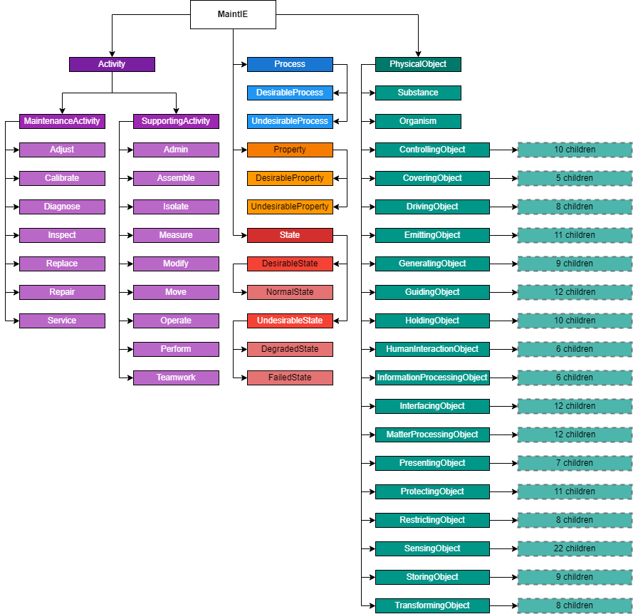

# MaintIE Scheme

## Table of Contents

1. [Overview](#1-overview)
2. [Entities](#2-entities)
   1. [PhysicalObject](#21-physical-object)
   2. [State](#22-state)
   3. [Process](#23-process)
   4. [Activity](#24-activity)
   5. [Property](#25-property)
   6. [Entity Classes](#26-entity-classes)
3. [Relations](#3-relations)
   1. [Mereological Relations](#31-mereological-relations)
   2. [Property Relations](#32-property-relation)
   3. [Type Relations](#33-type-relation)
   4. [Participatory Relations](#34-participatory-relations)
   5. [Relation Classes](#35-relation-classes)
4. [Bibliography](#4-bibliography)

## 1. Overview

The MaintIE annotation scheme is made up of 224 total entity classes and 6 relations that capture phenomena within MWO short texts. The MaintIE scheme is guided by the following design requirements:

- [R1] Incorporate a minimal yet sufficient number of classes and relations to capture the information relevant to domain experts.
- [R2] Include adequate instances within each class to support model training and generalisation without necessitating additional processing steps, such as oversampling.
- [R3] Build upon existing general domain annotation efforts and semantic frameworks to ensure compatibility and leverage prior research.
- [R4] Align with established international engineering standards to promote consistency and interoperability.
- [R5] Enable the identification of implicit information or missing text, which results from shared engineering understanding of the context.
- [R6] Implement a well-structured and accessible object hierarchy that is not overly complex or deep, facilitating annotator comprehension.
- [R7] Integrate engineering common sense and domain-specific knowledge into the semantic formalisation of MWO texts.
- [R8] Ensure usability by annotators who are either engineers or have received adequate training to become familiar with maintenance texts.

**Notation**: `(X)[Y]` represents an entity with the text _X_ and class _Y_. `(X1)[Y1]-[R]->(X2)[Y2]` represents a triple composed of two entities and one relation (_R_). Hence, (car)[PhysicalObject]-[hasPart]->(engine)[PhysicalObject] represents the fact that a car of type PhysicalObject has the part engine of type PhysicalObject.

## 2. Entities

MaintIE consists of 224 unique entity classes, grouped into five top-level hierarchical classes: _PhysicalObject_, _State_, _Process_, _Activity_, and _Property_. An illustrative example of these classes is shown in the [README](README.md). Each top-level class is described below, and more detailed information is outlined in the following table.

### 2.1. Physical Object

MaintIE adopts a systems engineering approach to annotation of physical objects utilising the _inherent function_ of objects as the basis for item classification[^1]. This allows for the direct use of the function-based object classification section in the IEC 81346-2:2019 standard for Industrial Systems, installations and equipment and industrial products -- Structuring principles and reference designations -- Classification of objects and codes for classes[^2]. MaintIE adopts the function-based taxonomy in the IEC 81346-2 Standard for the _PhysicalObject_ entity class and extends this to incorporate a limited set of physical objects that have essential semantic roles in maintenance texts such as technicians (_Person_) and grease, oil, water (_Substance_). The resulting _PhysicalObject_ class is a three-tiered hierarchy with 19 second-tier classes and 173 third-tier classes.

### 2.2. State

Discerning the state or condition of physical objects is crucial for interpreting MWO texts. Moreover, it is significant for practical applications such as reducing equipment downtime to recognise how physical objects degrade and fail. In this context, MaintIE employs state classifications from [^3][^4], encompassing _State_, _State/DesirableState_, _State/ DesirableState/ NormalState_, _State/UndesirableState_, _State/UndesirableState/DegradedState_, and _State/UndesirableState/FailedState_.

### 2.3. Process

In addition to the state class, MaintIE captures the ontological modelling notion that equipment has a function that is realised in a process with _Process_, _Process/DesirableProcess_ and _Process/UndesirableProcess_ classes. While texts describing these processes might appear similar to texts describing states, the former must be distinguished from the latter as representing temporally dynamic events. For instance, "pump seized" depicts a pump in a static, adverse state, whereas "pump leaking" indicates an ongoing detrimental process (refer to the main figure in the [README](README.md) for more examples).

### 2.4. Activity

Identifying what specific preventative and restorative activities are performed on physical objects is crucial for identifying design and performance issues, refining maintenance practices, and facilitating proactive planning[^5]. Borrowing from Woods et al.[^6], MaintIE uses a three-tiered _Activity_ hierarchy with 2 second-tier classes and 16 third-tier classes.

### 2.5. Property

The property class refers to the attributes or features of an object. In this research, properties can be syntactically characterised as either essential -- attributes that an object inherently possesses -- or accidental -- attributes an object can have but are not necessarily intrinsic to it[^7]. For example, while a 'pipe' intrinsically has 'mass', it doesn't necessarily have a 'dent', though the latter is possible. MaintIE captures properties as: _Property_, _Property/DesirableProperty_ and _Property/UndesirableProperty_, mirroring the subclass structure of state and process.

### 2.6. Entity Classes

| Type                                                                             | Description                     | Example Terms                                      |
| -------------------------------------------------------------------------------- | ------------------------------- | -------------------------------------------------- |
| Activity                                                                         |                                 |                                                    |
| Activity / MaintenanceActivity                                                   |                                 |                                                    |
| Activity / MaintenanceActivity / Adjust                                          |                                 | alignment, retension, tighten                      |
| Activity / MaintenanceActivity / Calibrate                                       |                                 | calibration                                        |
| Activity / MaintenanceActivity / Diagnose                                        |                                 | diagnose, fault find, troubleshoot                 |
| Activity / MaintenanceActivity / Inspect                                         |                                 | check, inspect                                     |
| Activity / MaintenanceActivity / Replace                                         |                                 | change out, replace, replacement                   |
| Activity / MaintenanceActivity / Repair                                          |                                 | jump-start, overhaul, reweld                       |
| Activity / MaintenanceActivity / Service                                         |                                 | clean, blow out                                    |
| Activity / SupportingActivity                                                    |                                 | -                                                  |
| Activity / SupportingActivity / Admin                                            |                                 | air freight, call out, tagging                     |
| Activity / SupportingActivity / Assemble                                         |                                 | fit, set-up, wire                                  |
| Activity / SupportingActivity / Isolate                                          |                                 | deisolate, disable, isolate                        |
| Activity / SupportingActivity / Measure                                          |                                 | measure up, sample                                 |
| Activity / SupportingActivity / Modify                                           |                                 | extend, rerun, seal                                |
| Activity / SupportingActivity / Move                                             |                                 | remove, rotate                                     |
| Activity / SupportingActivity / Operate                                          |                                 | close, disable, lock, raise                        |
| Activity / SupportingActivity / Perform                                          |                                 | carry out, heat up                                 |
| Activity / SupportingActivity / Teamwork                                         |                                 | call, assist                                       |
| State                                                                            |                                 | -                                                  |
| State / DesirableState                                                           |                                 | operational                                        |
| State / DesirableState / NormalState                                             |                                 | healthy                                            |
| State / UndesirableState                                                         |                                 | error, fault, missing, warm                        |
| State / UndesirableState / DegradedState                                         |                                 | bent, worn                                         |
| State / UndesirableState / FailedState                                           |                                 | broken, out of service, seized, unserviceable      |
| Process                                                                          |                                 |                                                    |
| Process / DesirableProcess                                                       |                                 | tramming                                           |
| Process / UndesirableProcess                                                     |                                 | creeping, discharging, leaking, weeping            |
| Property                                                                         |                                 |                                                    |
| Property / DesirableProperty                                                     |                                 | charge                                             |
| Property / UndesirableProperty                                                   |                                 | crack, hole, noise                                 |
| PhysicalObject                                                                   |                                 | electrical components, machine                     |
| PhysicalObject / Substance                                                       |                                 |                                                    |
| PhysicalObject / Substance / Gas                                                 |                                 | air                                                |
| PhysicalObject / Substance / Liquid                                              |                                 | fuel, hydraulic oil, Loctite                       |
| PhysicalObject / Substance / Solid                                               |                                 | debris, dust                                       |
| PhysicalObject / Substance / Mixture                                             |                                 | mud                                                |
| PhysicalObject / Organism                                                        |                                 | bacteria                                           |
| PhysicalObject / Organism / Person                                               |                                 | boilermaker, fitters                               |
| PhysicalObject / SensingObject                                                   |                                 | sensor                                             |
| PhysicalObject / SensingObject / ElectricPotentialSensingObject                  |                                 |                                                    |
| PhysicalObject / SensingObject / ResistivitySensingObject                        |                                 | RTD, thermal resistivity detector                  |
| PhysicalObject / SensingObject / ElectricCurrentSensingObject                    |                                 | overload relay                                     |
| PhysicalObject / SensingObject / DensitySensingObject                            |                                 | aerometer, density sensor                          |
| PhysicalObject / SensingObject / FieldSensingObject                              |                                 | proximity sensor                                   |
| PhysicalObject / SensingObject / FlowSensingObject                               |                                 | flow switch, flowmeter                             |
| PhysicalObject / SensingObject / PhysicalDimensionSensingObject                  |                                 | proximity switch, limits                           |
| PhysicalObject / SensingObject / EnergySensingObject                             |                                 | energy sensor, flow energy meter                   |
| PhysicalObject / SensingObject / PowerSensingObject                              |                                 | ignition switch, smart meter                       |
| PhysicalObject / SensingObject / TimeSensingObject                               |                                 | timing sensor                                      |
| PhysicalObject / SensingObject / LevelSensingObject                              |                                 | coolant metre, depth counter, level sensor         |
| PhysicalObject / SensingObject / HumiditySensingObject                           |                                 | humidity sensor                                    |
| PhysicalObject / SensingObject / PressureSensingObject                           |                                 | pressure sensor, pressure switch                   |
| PhysicalObject / SensingObject / ConcentrationSensingObject                      |                                 | chip indicator, chip sensor, smoke detector        |
| PhysicalObject / SensingObject / RadiationSensingObject                          |                                 | light sensor,                                      |
| PhysicalObject / SensingObject / TimeRatingObject                                |                                 | grease timer, speedometer, speed sensor            |
| PhysicalObject / SensingObject / TemperatureSensingObject                        |                                 | thermostat, temperature sensor                     |
| PhysicalObject / SensingObject / MultiQuantitySensingObject                      |                                 | Buchholz relay                                     |
| PhysicalObject / SensingObject / ForceSensingObject                              |                                 | payload system, weightometer                       |
| PhysicalObject / SensingObject / AudioVisualSensingObject                        |                                 | camera, reverse camera                             |
| PhysicalObject / SensingObject / InformationSensingObject                        |                                 | barcode reader                                     |
| PhysicalObject / SensingObject / IncidentSensingObject                           |                                 | person detector                                    |
| PhysicalObject / StoringObject                                                   |                                 |                                                    |
| PhysicalObject / StoringObject / CapacitiveStoringObject                         |                                 | capacitor                                          |
| PhysicalObject / StoringObject / InductiveStoringObject                          |                                 | inductor                                           |
| PhysicalObject / StoringObject / ElectrochemicalStoringObject                    |                                 | dry cell, flow battery                             |
| PhysicalObject / StoringObject / InformationStoringObject                        |                                 | information storing media                          |
| PhysicalObject / StoringObject / OpenStationaryStoringObject                     |                                 | armrest, cable reel                                |
| PhysicalObject / StoringObject / EnclosedStationaryStoringObject                 |                                 | air receiver, pressure vessel, tank                |
| PhysicalObject / StoringObject / MoveableStoringObject                           |                                 | bottle, bucket, trailer                            |
| PhysicalObject / StoringObject / ThermalEnergyStoringObject                      |                                 | gas tank                                           |
| PhysicalObject / StoringObject / MechanicalEnergyStoringObject                   |                                 | accumulator                                        |
| PhysicalObject / EmittingObject                                                  |                                 | cooler, heater                                     |
| PhysicalObject / EmittingObject / LightObject                                    |                                 | beacon, headlight, lamp                            |
| PhysicalObject / EmittingObject / ElectricHeatingObject                          |                                 | pie warmer                                         |
| PhysicalObject / EmittingObject / ElectricCoolingObject                          |                                 | air conditioner                                    |
| PhysicalObject / EmittingObject / WirelessPowerObject                            |                                 | microwave oven                                     |
| PhysicalObject / EmittingObject / ThermalEnergyTransferObject                    |                                 | fridge, radiator                                   |
| PhysicalObject / EmittingObject / CombustionHeatingObject                        |                                 | oil burner                                         |
| PhysicalObject / EmittingObject / ThermalHeatingObject                           |                                 | de-ice unit                                        |
| PhysicalObject / EmittingObject / ThermalCoolingObject                           |                                 | aftercooler, oil cooler                            |
| PhysicalObject / EmittingObject / NuclearPoweredHeatingObject                    |                                 | boiling water reactor                              |
| PhysicalObject / EmittingObject / ParticleEmittingObject                         |                                 | particle generator                                 |
| PhysicalObject / EmittingObject / AcousticWaveEmittingObject                     |                                 | speaker                                            |
| PhysicalObject / ProtectingObject                                                |                                 |                                                    |
| PhysicalObject / ProtectingObject / OvervoltageProtectingObject                  |                                 | surge absorber                                     |
| PhysicalObject / ProtectingObject / EarthFaultCurrentProtectingObject            |                                 | residual current device                            |
| PhysicalObject / ProtectingObject / OvercurrentProtectingObject                  |                                 | fuse                                               |
| PhysicalObject / ProtectingObject / FieldProtectingObject                        |                                 | electromagnetic field shield                       |
| PhysicalObject / ProtectingObject / PressureProtectingObject                     |                                 | expansion tank, pressure compensator, safety valve |
| PhysicalObject / ProtectingObject / FireProtectingObject                         |                                 | AFFF system, fire extinguisher                     |
| PhysicalObject / ProtectingObject / MechanicalForceProtectingObject              |                                 | safety clutch                                      |
| PhysicalObject / ProtectingObject / PreventiveProtectingObject                   |                                 | handrail, padding                                  |
| PhysicalObject / ProtectingObject / WearProtectingObject                         |                                 | grease, liner, oil                                 |
| PhysicalObject / ProtectingObject / EnvironmentProtectingObject                  |                                 | mudflap, rock deflector                            |
| PhysicalObject / ProtectingObject / TemperatureProtectingObject                  | Introduced.                     | coolant, exhaust shield                            |
| PhysicalObject / GeneratingObject                                                |                                 |                                                    |
| PhysicalObject / GeneratingObject / MechanicalToElectricalEnergyGeneratingObject |                                 | alternator, generator                              |
| PhysicalObject / GeneratingObject / ChemicalToElectricalEnergyGeneratingObject   |                                 | battery                                            |
| PhysicalObject / GeneratingObject / SolarToElectricalEnergyGeneratingObject      |                                 | solar cell                                         |
| PhysicalObject / GeneratingObject / SignalGeneratingObject                       |                                 | phone                                              |
| PhysicalObject / GeneratingObject / ContinuousTransferObject                     |                                 | conveyor, drag                                     |
| PhysicalObject / GeneratingObject / DiscontinuousTransferObject                  |                                 | crane, hoist, loader                               |
| PhysicalObject / GeneratingObject / LiquidFlowGeneratingObject                   |                                 | fuel system, injector, pump                        |
| PhysicalObject / GeneratingObject / GaseousFlowGeneratingObject                  |                                 | blower, fan, turbo                                 |
| PhysicalObject / GeneratingObject / SolarToThermalEnergyGeneratingObject         |                                 | solar panel                                        |
| PhysicalObject / MatterProcessingObject                                          |                                 |                                                    |
| PhysicalObject / MatterProcessingObject / PrimaryFormingObject                   |                                 | 3D-printer                                         |
| PhysicalObject / MatterProcessingObject / SurfaceTreatmentObject                 |                                 | wiper                                              |
| PhysicalObject / MatterProcessingObject / AssemblingObject                       |                                 | welder                                             |
| PhysicalObject / MatterProcessingObject / ForceSeparatingObject                  |                                 | cyclone, oil centrifuge, water separator           |
| PhysicalObject / MatterProcessingObject / ThermalSeparatingObject                |                                 | dryer                                              |
| PhysicalObject / MatterProcessingObject / MechanicalSeparatingObject             |                                 | air filter, cleaners, screen                       |
| PhysicalObject / MatterProcessingObject / ElectricOrMagneticSeparatingObject     |                                 | magnetic separator                                 |
| PhysicalObject / MatterProcessingObject / ChemicalSeparatingObject               |                                 | filtration unit                                    |
| PhysicalObject / MatterProcessingObject / GrindingAndCrushingObject              |                                 | cutting edge, GET, tooth                           |
| PhysicalObject / MatterProcessingObject / AgglomeratingObject                    |                                 | flocculator                                        |
| PhysicalObject / MatterProcessingObject / MixingObject                           |                                 | oil blender                                        |
| PhysicalObject / MatterProcessingObject / ReactingObject                         |                                 | gasifier                                           |
| PhysicalObject / InformationProcessingObject                                     |                                 |                                                    |
| PhysicalObject / InformationProcessingObject / ElectricSignalProcessingObject    |                                 | computer, router                                   |
| PhysicalObject / InformationProcessingObject / ElectricSignalRelayingObject      |                                 | relay                                              |
| PhysicalObject / InformationProcessingObject / OpticalSignallingObject           |                                 | optical repeater                                   |
| PhysicalObject / InformationProcessingObject / FluidSignallingObject             |                                 | pilot valve                                        |
| PhysicalObject / InformationProcessingObject / MechanicalSignallingObject        |                                 | mechanical regulator                               |
| PhysicalObject / InformationProcessingObject / MultipleKindSignallingObject      |                                 | multiple kind switch                               |
| PhysicalObject / DrivingObject                                                   |                                 |                                                    |
| PhysicalObject / DrivingObject / ElectromagneticRotationalDrivingObject          |                                 | synchronous motor, wiper motor                     |
| PhysicalObject / DrivingObject / ElectromagneticLinearDrivingObject              |                                 | actuator, solenoid                                 |
| PhysicalObject / DrivingObject / MagneticForceDrivingObject                      |                                 | magnet                                             |
| PhysicalObject / DrivingObject / PiezoelectricDrivingObject                      |                                 | piezoelectric actuator                             |
| PhysicalObject / DrivingObject / MechanicalEnergyDrivingObject                   |                                 | drive, slew                                        |
| PhysicalObject / DrivingObject / FluidPoweredDrivingObject                       |                                 | hydraulic motor, lift cylinder                     |
| PhysicalObject / DrivingObject / CombustionEngine                                |                                 | engine                                             |
| PhysicalObject / DrivingObject / HeatEngine                                      |                                 | steam engine                                       |
| PhysicalObject / CoveringObject                                                  |                                 |                                                    |
| PhysicalObject / CoveringObject / InfillingObject                                |                                 | boot, gasket, rubber                               |
| PhysicalObject / CoveringObject / ClosureObject                                  |                                 | bonnet, hood, cap                                  |
| PhysicalObject / CoveringObject / FinishingObject                                |                                 | flooring, roof                                     |
| PhysicalObject / CoveringObject / TerminatingObject                              |                                 | crown                                              |
| PhysicalObject / CoveringObject / HidingObject                                   |                                 | roof flashing                                      |
| PhysicalObject / PresentingObject                                                |                                 |                                                    |
| PhysicalObject / PresentingObject / VisibleStateIndicator                        |                                 | flag, scoreboard, warning beacon                   |
| PhysicalObject / PresentingObject / ScalarDisplay                                |                                 | gauge, sight glass                                 |
| PhysicalObject / PresentingObject / GraphicalDisplay                             |                                 | VIMS                                               |
| PhysicalObject / PresentingObject / AcousticDevice                               |                                 | backup alarm, horn                                 |
| PhysicalObject / PresentingObject / TactileDevice                                |                                 | vibrator                                           |
| PhysicalObject / PresentingObject / OrnamentalObject                             |                                 | stucco                                             |
| PhysicalObject / PresentingObject / MultipleFormPresentingObject                 |                                 | head unit, monitor, TV                             |
| PhysicalObject / ControllingObject                                               |                                 | controller, valve bank                             |
| PhysicalObject / ControllingObject / ElectricControllingObject                   |                                 | breaker, contactor, isolator                       |
| PhysicalObject / ControllingObject / ElectricSeparatingObject                    |                                 | electrical isolator, electrical switch             |
| PhysicalObject / ControllingObject / ElectricEarthingObject                      |                                 | earth terminal, ground fault relay                 |
| PhysicalObject / ControllingObject / SealedFluidSwitchingObject                  |                                 | drain plugs, solenoid valve                        |
| PhysicalObject / ControllingObject / SealedFluidVaryingObject                    |                                 | tap, vent valve                                    |
| PhysicalObject / ControllingObject / OpenFlowControllingObject                   |                                 | baffle, louver                                     |
| PhysicalObject / ControllingObject / SpaceAccessObject                           |                                 | door, gate                                         |
| PhysicalObject / ControllingObject / SolidSubstanceFlowVaryingObject             |                                 | diverter valve                                     |
| PhysicalObject / ControllingObject / MechanicalMovementControllingObject         |                                 | latch, lock, steering                              |
| PhysicalObject / ControllingObject / MultipleMeasureControllingObject            |                                 | earthing and disconnecting switch                  |
| PhysicalObject / RestrictingObject                                               |                                 |                                                    |
| PhysicalObject / RestrictingObject / ElectricityRestrictingObject                |                                 | diode, resistor                                    |
| PhysicalObject / RestrictingObject / ElectricityStabilisingObject                |                                 | voltage regulator                                  |
| PhysicalObject / RestrictingObject / SignalStabilisingObject                     |                                 | signal filter                                      |
| PhysicalObject / RestrictingObject / MovementRestrictingObject                   |                                 | brakes, seat belt                                  |
| PhysicalObject / RestrictingObject / ReturnFlowRestrictingObject                 |                                 | flap, non-return valve                             |
| PhysicalObject / RestrictingObject / FlowRestrictor                              |                                 | air outlet, regulator                              |
| PhysicalObject / RestrictingObject / LocalClimateStabilisingObject               |                                 | blind, roller blind                                |
| PhysicalObject / RestrictingObject / AccessRestrictingObject                     |                                 | glass window                                       |
| PhysicalObject / HumanInteractionObject                                          |                                 |                                                    |
| PhysicalObject / HumanInteractionObject / FaceInteractionObject                  |                                 | eye focus reader                                   |
| PhysicalObject / HumanInteractionObject / HandInteractionObject                  |                                 | handle, lever                                      |
| PhysicalObject / HumanInteractionObject / FootInteractionObject                  |                                 | pedals                                             |
| PhysicalObject / HumanInteractionObject / FingerInteractionObject                |                                 | keypad                                             |
| PhysicalObject / HumanInteractionObject / MovementInteractionObject              |                                 | joystick                                           |
| PhysicalObject / HumanInteractionObject / MultiInteractionDevice                 |                                 | game controller                                    |
| PhysicalObject / TransformingObject                                              |                                 |                                                    |
| PhysicalObject / TransformingObject / ElectricEnergyTransformingObject           |                                 | constant voltage transformer, slip ring            |
| PhysicalObject / TransformingObject / ElectricEnergyConvertingObject             |                                 | power supply, inverter, rectifier                  |
| PhysicalObject / TransformingObject / UniversalPowerSupply                       |                                 | power supply                                       |
| PhysicalObject / TransformingObject / SignalConvertingObject                     |                                 | aerial, two-way radios                             |
| PhysicalObject / TransformingObject / MechanicalEnergyTransformingObject         |                                 | differential, pinion                               |
| PhysicalObject / TransformingObject / MassReductionObject                        |                                 | turning machine                                    |
| PhysicalObject / TransformingObject / MatterReshapingObject                      |                                 | dies, die inserts                                  |
| PhysicalObject / TransformingObject / OrganicPlant                               |                                 | grass                                              |
| PhysicalObject / HoldingObject                                                   |                                 | cluster                                            |
| PhysicalObject / HoldingObject / PositioningObject                               |                                 | bracket, clamps                                    |
| PhysicalObject / HoldingObject / CarryingObject                                  |                                 | decking, platform                                  |
| PhysicalObject / HoldingObject / EnclosingObject                                 |                                 | cabinet, crankcase, housing                        |
| PhysicalObject / HoldingObject / StructuralSupportingObject                      |                                 | A-frame, boom, supports                            |
| PhysicalObject / HoldingObject / ReinforcingObject                               |                                 | cross member, stiffener plate                      |
| PhysicalObject / HoldingObject / FramingObject                                   |                                 | door frame, window frame                           |
| PhysicalObject / HoldingObject / JointingObject                                  |                                 | bushes, roller, thrust bearing                     |
| PhysicalObject / HoldingObject / FasteningObject                                 |                                 | bolt, pin, stud                                    |
| PhysicalObject / HoldingObject / LevellingObject                                 |                                 | -                                                  |
| PhysicalObject / HoldingObject / ExistingGround                                  |                                 | -                                                  |
| PhysicalObject / GuidingObject                                                   |                                 |                                                    |
| PhysicalObject / GuidingObject / ElectricEnergyGuidingObject                     | Introduced for ambiguous cases. | cables, wire                                       |
| PhysicalObject / GuidingObject / ReferencingPotentialGuidingObject               |                                 | earth cable, earth connection                      |
| PhysicalObject / GuidingObject / ElectricSignalGuidingObject                     |                                 | control cable, coaxial, data cable                 |
| PhysicalObject / GuidingObject / LightGuidingObject                              |                                 | mirror                                             |
| PhysicalObject / GuidingObject / SoundGuidingObject                              |                                 | sound reflector                                    |
| PhysicalObject / GuidingObject / SolidMatterGuidingObject                        |                                 | chute, dirt chute                                  |
| PhysicalObject / GuidingObject / OpenEnclosureGuidingObject                      |                                 | guide                                              |
| PhysicalObject / GuidingObject / ClosedEnclosureGuidingObject                    |                                 | hose, lines, exhaust                               |
| PhysicalObject / GuidingObject / MechanicalEnergyGuidingObject                   |                                 | belt, chain, pulley                                |
| PhysicalObject / GuidingObject / RailObject                                      |                                 | tracks                                             |
| PhysicalObject / GuidingObject / ThermalEnergyGuidingObject                      |                                 | heat sink                                          |
| PhysicalObject / GuidingObject / MultipleFlowGuidingObject                       |                                 | umbilical                                          |
| PhysicalObject / GuidingObject / HighVoltageElectricEnergyGuidingObject          |                                 | high voltage cable                                 |
| PhysicalObject / GuidingObject / LowVoltageElectricEnergyGuidingObject           |                                 | low voltage cable                                  |
| PhysicalObject / InterfacingObject                                               |                                 |                                                    |
| PhysicalObject / InterfacingObject / HighVoltageConnectingObject                 |                                 | junction box                                       |
| PhysicalObject / InterfacingObject / LowVoltageConnectingObject                  |                                 | power point                                        |
| PhysicalObject / InterfacingObject / PotentialConnectingObject                   |                                 | brushes                                            |
| PhysicalObject / InterfacingObject / ElectricSignalConnectingObject              |                                 | signal distributor                                 |
| PhysicalObject / InterfacingObject / LightCollectingObject                       |                                 |                                                    |
| PhysicalObject / InterfacingObject / CollectingInterfacingObject                 |                                 | drain, parts washer                                |
| PhysicalObject / InterfacingObject / SealedFlowConnectingObject                  |                                 | fitting                                            |
| PhysicalObject / InterfacingObject / NonDetachableCoupling                       |                                 | coupling, hitch                                    |
| PhysicalObject / InterfacingObject / DetachableCoupling                          |                                 | box coupling                                       |
| PhysicalObject / InterfacingObject / LevelConnectingObject                       |                                 | boarding ladder, ladder                            |
| PhysicalObject / InterfacingObject / SpaceLinkingObject                          |                                 | cavity, glass                                      |
| PhysicalObject / InterfacingObject / MultipleFlowConnectorObject                 |                                 |                                                    |

## 3. Relations

MaintIE presents four distinct categories of relations: _mereological_, _property_, _type_, and _participatory_. Each type is described below, with descriptions and examples outlined in the following table. For a visual representation of these relations, please refer to the [README](README.md).

### 3.1. Mereological Relations

Mereological relations capture parthood and involve part-whole relationships[^8] such as _hasPart_ and _contains_. These relations are essential for representing the taxonomical structure and organisation of physical objects in MWO texts. For instance, the _hasPart_ relation can be used to capture that an "engine" has a "radiator" as one of its parts -- _hasPart(engine, radiator)_. Similarly, the _contains_ relation can be used to represent that a "radiator" contains "coolant" -- _contains(radiator, coolant)_.

### 3.2. Property Relation

In MaintIE, the property relation involves linking the properties or attributes of entities. Specifically, the relation used is the _hasProperty_ relation. This relation is used to express that a physical object possesses a certain property. For example, the relation can be used to indicate that a "pump" possesses the "pressure" property, like this: _hasProperty(pump, pressure)_.

### 3.3. Type Relation

The type relation involves the classification or categorisation of entities. In MaintIE, this relation is expressed through the _isA_ (subsumption) relation. This relation captures the idea that one entity is a specific instance or subclass of another entity. For instance, the _isA(diesel engine, engine)_ relation indicates that a "diesel engine" belongs to the "engine" category. This relation captures the taxonomical structure of physical objects and states, thus supporting inference in downstream applications. An example of this relation can be seen in the [README](README.md).

### 3.4. Participatory Relations

Participatory relations refer to the roles played by different entities in activities, states or processes. To simplify the annotation process, MaintIE uses a set of relations inspired by PropBank's [^9]agent (ARG0) and patient (ARG1) labels accessed via the [Unified Verb Index](https://verbs.colorado.edu/verb-index/index.php). These labels are semantically defined as Proto-Agent sproperties[^10]. As MaintIE uses a closed set of typed entities, these labels have been transformed into the semantic relations _hasParticipant/hasAgent_ and _hasParticipant/hasPatient_ to capture the participation of entities as agents, causes, or experiencers, as well as those undergoing a change of state or being affected by actions.

### 3.5. Relation Classes

| Type                        | Description                              | Examples                                     |
| --------------------------- | ---------------------------------------- | -------------------------------------------- |
| contains                    | Mereological relation: A _contains_ B.   | (engine)[...]-[contains]->(oil)[...]         |
| hasPart                     | Mereological relation: A _has part_ B.   | (engine)[...]-[hasPart]->(gasket)[...]       |
| hasParticipant / hasPatient | Participatory relation: A has patient B. | (service)[...]-[hasPatient]->(engine)[...]   |
| hasParticipant / hasAgent   | Participatory relation: A has agent B.   | (service)[...]-[hasAgent]->(technician)[...] |
| hasProperty                 | Property relation: A has property B.     | (engine)[...]-[hasProperty]->(pressure)[...] |
| isA                         | Type relation: A is a B.                 | (diesel engine)[...]-[isA]->(engine)[...]    |

Note: The top-level `hasParticipant` relation was not used in MaintIE corpora creation; however, it could be used for instances where the agent/patient roles are ambiguous or unable to be resolved.

## 4. Bibliography

[^1]: Stone, Robert B., and Kristin L. Wood. 1999. "Development of a Functional Basis for Design." In _International Design Engineering Technical Conferences and Computers and Information in Engineering Conference_, 261-275. American Society of Mechanical Engineers.
[^2]: IEC. 2019. "IEC 81346-2 Industrial systems, installations and equipment and industrial products -- Structuring principles and reference designations -- Part 2: Classification of objects and codes for classes." Geneva, Switzerland: European Committee for Electrotechnical Standardization.
[^3]: Karray, Mohamed Hedi, Farhad Ameri, Melinda Hodkiewicz, and Thierry Louge. 2019. "ROMAIN: Towards a BFO Compliant Reference Ontology for Industrial Maintenance." Applied Ontology. 14 (2): 155–177.
[^4]: Woods, C., M. Selway, M. Hodkiewicz, F. Ameri, and others. 2021. "On the Notion of Maintenance State for Industrial Assets." In _FOMI 2021: 11th International Workshop on Formal Ontologies meet Industry, JOWO 2021_, 1-14.
[^5]: Márquez, Adolfo Crespo. 2007. _The Maintenance Management Framework: Models and Methods for Complex Systems Maintenance_. Springer Science & Business Media.
[^6]: Woods, Caitlin, Matt Selway, Tyler Bikaun, Markus Stumptner, and Melinda Hodkiewicz. 2023. "An ontology for maintenance activities and its application to data quality." _Semantic Web Journal_. Pre-press: 1–34.
[^7]: Robertson, Teresa, and Philip Atkins. 2013. "Essential vs. accidental properties." In _Stanford Encyclopedia of Philosophy_.
[^8]: Varzi, Achille. 2003. "Mereology." Stanford Encyclopedia Of Philosophy. https://plato.stanford.edu/entries/mereology/.
[^9]: Kingsbury, Paul R., and Martha Palmer. 2002. "From TreeBank to PropBank." In _International Conference on Language Resources and Evaluation (LREC)_, 1989-1993.
[^10]: Dowty, David. 1991. “Thematic Proto-roles and Argument Selection.” _Language_ 67 (3): 547–619.
